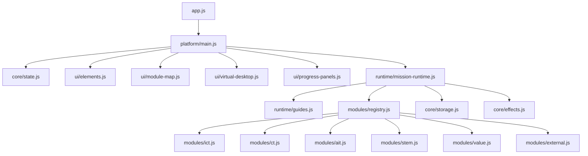

# 플랫폼 아키텍처

## 핵심 방향

현재 프로토타입의 핵심은 `메인 플랫폼`과 `개별 프로그램`을 분리하는 것입니다. 메인 플랫폼은 전체 맵, 진행 상태, 미션 오버레이, 가이드, 배지 정도만 책임집니다. 각 교육 콘텐츠는 `platform/modules` 아래의 독립 렌더러이거나, 외부 폴더의 완성 프로그램으로 연결합니다.

## 디렉터리 책임

```text
/
  index.html
  app.js
  styles.css
  platform/
    data/
      catalog.js       # 대영역과 모듈 목록
      ethics.js        # VALUE 영역의 윤리 원칙 데이터
    core/
      state.js         # 플랫폼/미션 상태 초기화
      dom.js           # DOM 생성, 드래그, 문자열 비교 유틸
      effects.js       # 라운드 성공/모듈 클리어 시각효과
      storage.js       # 브라우저 로컬 진행 기록
    runtime/
      guides.js        # 시작 안내와 무응답 가이드 대상 강조
      mission-runtime.js
                      # 모듈 시작, 라운드 진행, 완료, 저장 흐름
    ui/
      elements.js      # 필수 DOM 요소 조회
      module-map.js    # 대영역/모듈 카드와 상세 패널 렌더링
      virtual-desktop.js
                      # 윈도우형 바탕화면, 시작 메뉴, 기본 앱, 모듈 아이콘 런처, 창 제어
      progress-panels.js
                      # 배지 보드와 교사용 진행 보드
      views.js         # 맵/컴퓨터/배지/교사 화면 전환
    modules/
      ict.js           # ICT 세 모듈
      ct.js            # 코딩 퍼즐, 순서도, 언플러그드
      ait.js           # AI 기술 흐름 시각화
      stem.js          # 핀테크, 신약 개발 실험
      value.js         # AI 성향 딜레마 랩
      external.js      # 로컬 HTML iframe과 외부 URL 연결
      registry.js      # 모듈 타입과 렌더러 연결
    styles/
      base.css
      shell.css
      platform.css
      mission.css
      modules.css
  external/
    ait-node/
    ai-paradigm-game/
    interactive-challenge/
    stem-ai-studio/
    value-dilemma/
    legacy-sources/
  assets/
    desktop-wallpaper.png
                    # 가상 컴퓨터 바탕화면 이미지
  docs/
    source/
```

## 호출 흐름



## 책임 경계

| 파일/폴더 | 책임 | 주로 수정하는 경우 |
| --- | --- | --- |
| `platform/main.js` | 앱 조립, 이벤트 연결 | 새 전역 패널이나 앱 수준 흐름 추가 |
| `platform/data/catalog.js` | 대영역과 모듈 메타데이터 | 새 모듈 추가, 제목/설명/상태 수정 |
| `platform/ui/*` | 플랫폼 화면 렌더링 | 맵, 가상 데스크톱, 상세 패널, 배지, 교사용 화면 디자인 변경 |
| `platform/runtime/*` | 미션 실행 공통 흐름 | 힌트 정책, 완료 처리, 진행 저장 방식 변경 |
| `platform/modules/*` | 각 교육 프로그램의 실제 상호작용 | 특정 모듈의 게임/시뮬레이션 개선 |
| `platform/core/*` | 공통 유틸과 상태/저장소 | 백엔드 저장소 연결, 공통 조작 유틸 변경 |
| `platform/styles/*` | CSS 분리 | 화면/모듈 스타일 변경 |

## 외부 프로그램 연결

첨부된 프로그램은 메인 플랫폼에 섞지 않고 공통 프로그램 프레임으로 연결합니다. 로컬 HTML은 iframe으로 열고, iframe을 막는 외부 서비스는 같은 프레임 안에서 새 창 링크로 제공합니다.

| 모듈 | 경로 | 방식 |
| --- | --- | --- |
| AI 패러다임 게임 | `external/ai-paradigm-game/index.html` | AIT 모듈에서 연결 |
| 노드 기반 AI 흐름 실습 | `external/ait-node/index.html` | AIT 모듈에서 연결 |
| 우주 탐사대 | `external/stem-ai-studio/apps/space-explorer.html` | AIT 모듈에서 연결 |
| Interactive Challenge | `external/interactive-challenge/index.html` | CT 모듈에서 연결 |
| AI Studio STEM 실험실 | `external/stem-ai-studio/index.html` | STEM 모듈에서 연결 |
| AI 성향 딜레마 랩 | `external/value-dilemma/ai-kids-judge.html` | VALUE 모듈에서 연결 |
| AI 가치 실습 링크 | `https://gemini.google.com/share/37d553e44c14` | VALUE 모듈에서 새 창 연결 |

외부 프로그램은 가능한 `external/` 아래에 모아 메인 플랫폼 코드와 분리합니다. 플랫폼에서는 `platform/data/catalog.js`의 `externalPath` 또는 `externalUrl`만 참조합니다.

## 새 모듈 추가 절차

1. `platform/data/catalog.js`에 모듈 메타데이터와 `type`을 추가합니다.
2. 새 체험이면 `platform/modules/{area}.js`에 렌더러 함수를 만듭니다.
3. `platform/modules/registry.js`에 `type -> renderer`와 반복 라운드 수를 등록합니다.
4. 메인 바탕화면에서 아이콘으로 열려야 하면 `platform/data/catalog.js`의 모듈 메타데이터만 추가하면 `virtual-desktop.js`가 자동으로 아이콘을 만듭니다.
5. 필요한 스타일만 `platform/styles/modules.css` 또는 별도 CSS로 분리합니다.
6. 모듈이 로컬 완성 프로그램이면 `platform/modules/external.js`를 재사용하고 `externalPath`를 지정합니다.
7. 모듈이 외부 웹 서비스이면 `externalUrl`을 지정합니다. iframe이 막히는 서비스도 같은 디자인의 연결 화면으로 처리됩니다.

## 백엔드 인수인계 기준

프론트엔드는 현재 `localStorage`로 완료 기록만 저장합니다. 전문 개발자가 백엔드를 붙일 때는 `platform/core/storage.js`의 `loadProgress`, `saveProgress`만 서버 API로 교체하면 됩니다.
